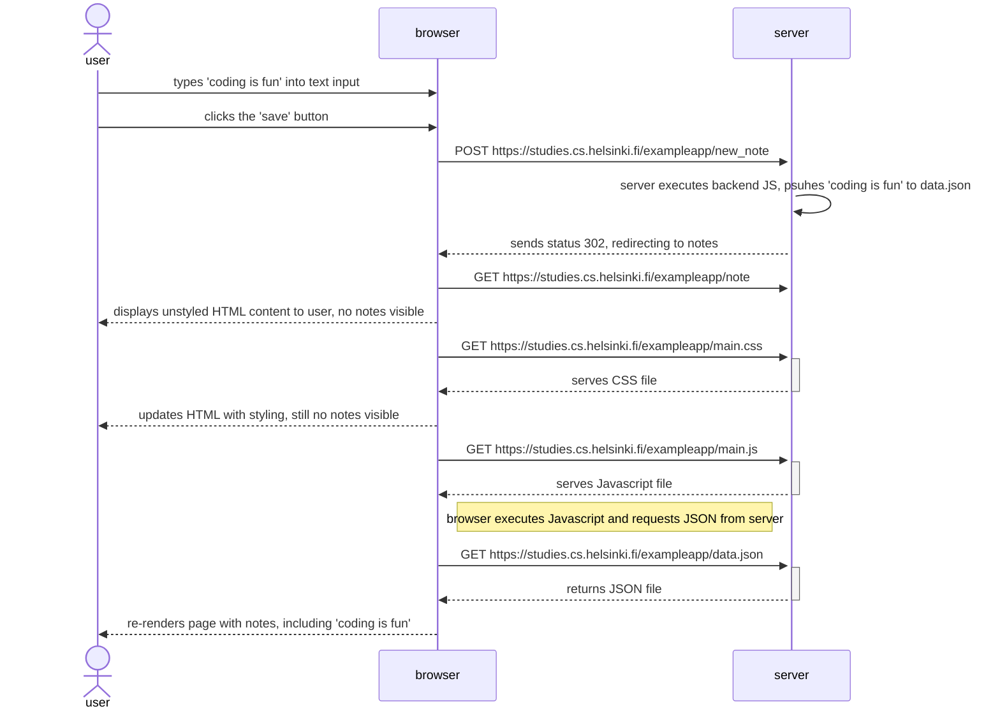

```mermaid
sequenceDiagram
  actor user
  participant browser
  participant server

  user->>browser: types 'coding is fun' into text input
  user->>browser: clicks the 'save' button
  browser->>+server: POST https://studies.cs.helsinki.fi/exampleapp/new_note
  server->>server: server executes backend JS, psuhes 'coding is fun' to data.json
  server-->>browser: sends status 302, redirecting to notes
  browser->>server: GET https://studies.cs.helsinki.fi/exampleapp/note
  browser-->>user: displays unstyled HTML content to user, no notes visible

  browser->>+server: GET https://studies.cs.helsinki.fi/exampleapp/main.css
  server-->>-browser: serves CSS file
  browser-->>user: updates HTML with styling, still no notes visible

  browser->>+server: GET https://studies.cs.helsinki.fi/exampleapp/main.js
  server-->>-browser: serves Javascript file
  Note right of browser: browser executes Javascript and requests JSON from server
  browser->>+server: GET https://studies.cs.helsinki.fi/exampleapp/data.json
  server-->>-browser: returns JSON file
  browser-->>user: re-renders page with notes, including 'coding is fun'
```
