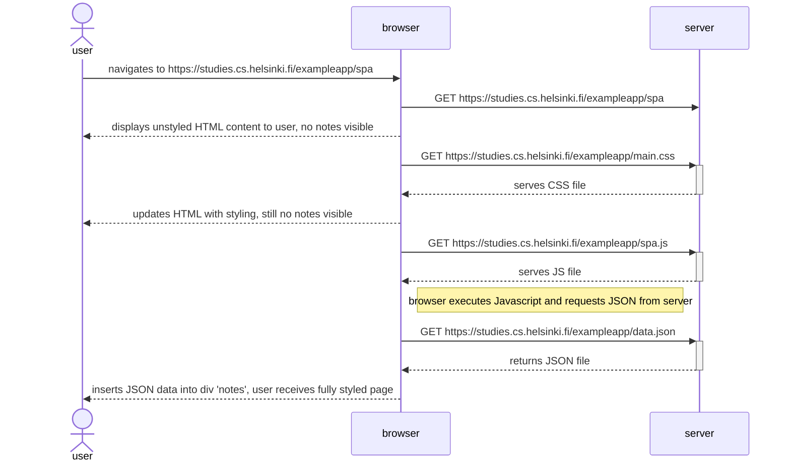

```mermaid
sequenceDiagram
actor user
participant browser
participant server

user->>browser: navigates to https://studies.cs.helsinki.fi/exampleapp/spa
browser->>server: GET https://studies.cs.helsinki.fi/exampleapp/spa
browser-->>user: displays unstyled HTML content to user, no notes visible

browser->>+server: GET https://studies.cs.helsinki.fi/exampleapp/main.css
server-->>-browser: serves CSS file
browser-->>user: updates HTML with styling, still no notes visible

browser->>+server: GET https://studies.cs.helsinki.fi/exampleapp/spa.js
server-->>-browser: serves JS file
Note right of browser: browser executes Javascript and requests JSON from server
browser->>+server: GET https://studies.cs.helsinki.fi/exampleapp/data.json
server-->>-browser: returns JSON file
browser-->>user: inserts JSON data into div 'notes', user receives fully styled page
```
