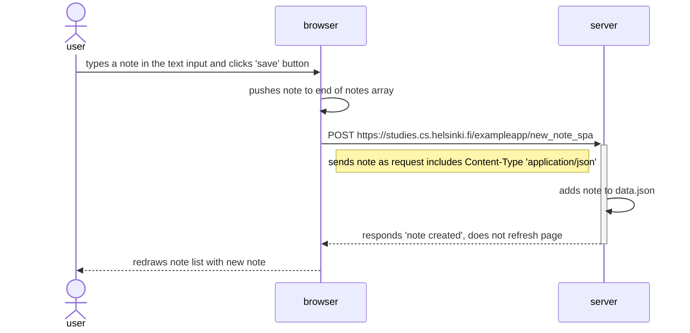

```mermaid
sequenceDiagram
actor user
participant browser
participant server

user->>browser: types a note in the text input and clicks 'save' button
browser->>browser: pushes note to end of notes array
browser->>+server: POST https://studies.cs.helsinki.fi/exampleapp/new_note_spa
Note right of browser: sends note as request includes Content-Type 'application/json'
server->>server: adds note to data.json
server-->>-browser: responds 'note created', does not refresh page
browser-->>user: redraws note list with new note
```
